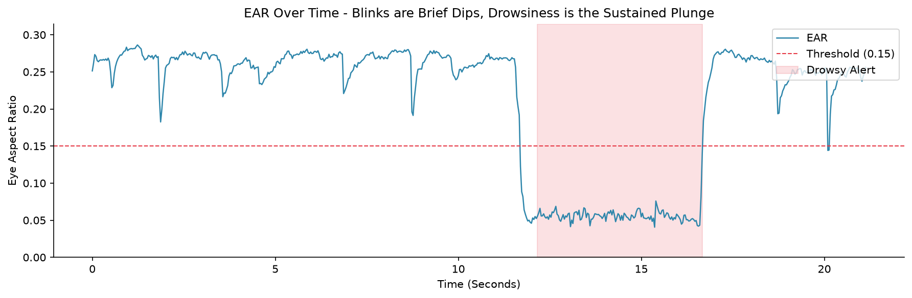

# Driver Drowsiness Detection

A real time computer vision system that watches a face and raises an alarm when the eyes stay closed long enough to signal drowsiness, the core of a driver monitoring system.

Built from geometry, not deep learning. No neural network is trained and no GPU is required. A pre-built facial landmark detector locates the eyes, a simple ratio measures how open they are, and a small state machine tells a blink apart from falling asleep. It runs faster than real time on a CPU only machine.

---

## The Result in One Image



Every blink and the one drowsy episode are visible in the eye openness signal. The briefe downward spikes are blinks. The wide plunge from ~12s to ~16.5s is the drowsy episode, where the eyes stay closed and the alarm triggers (red region).

**Note** - Several blinks dip below the threshold. A blink and a closed eye look identical in depth. What separates them is duration, and that is exactly what the system keys on.

---

## How it Works

```
  video / image folder / webcam
            │
            ▼
   MediaPipe Face Mesh        → 468 facial landmarks, eye points extracted
            │
            ▼
   Eye Aspect Ratio (EAR)     → one number: how open the eye is
            │
            ▼
   Drowsiness state machine   → EAR below threshold for N consecutive frames?
            │
            ▼
   Annotated video + alerts   → eye tracking, live EAR, DROWSY alarm
```

### Eye Aspect Ratio

EAR is the ratio of the eye's vertical opening to its horizontal width.

- **Open Eye** -> Lids apart -> EAR high
- **Closed Eye** -> Lids meet -> EAR collapses

Dividing by width makes it scale independent. Near or far from the camera, the same openness gives the same EAR, which is what lets one fixed threshold work across a whole video.

### Blink vs Drowsiness

A blink drops the EAR too, but only for a few frames. Drowsiness is the eye staying closed. So the rule is, **EAR below threshold for >15 consecutive frames (~0.5s) = drowsy.** A single open frame resets the count. That consecutive frame counter is the whole distinction, and it is why a naive depth only threshold (which would trigger a false alarm on every blink) is not enough.

---

## Setup

```bash
python3 -m venv .venv && source .venv/bin/activate
pip install -r requirements.txt
```
 
```bash
# process a video file → writes output/annotated.mp4
python -m src.run data/my_clip.mp4
 
# custom output path
python -m src.run data/my_clip.mp4 -o output/result.mp4
 
# live webcam (index 0), press q to quit
python -m src.run 0 --show
```

The runner prints a summary, which includes frames processed, drowsy events, and the timestamp each event began, and writes an annotated video showing the eye tracking, live EAR value, and the "DROWSY" alert.

---

## Design Decisions

**Geometry over deep learning.** Drowsiness here is a landmark detector plus a ratio plus a counter that requires no training, and no GPU. You can point at every step and say why the alarm fired. A trained eye stated CNN would be heavier, slower, opaque and no more accurate for this task.

**MediaPipe over dlib.** MediaPipe Face Mesh installs cleanly, runs fast on CPU, and gives 468 points with refined eye detail vs dlib's 68 point model which compiles from source and very restrictive for a memory constrained machine.

**Video files as the primary input, not just webcam.** Abstracting the frame source makes the system testable and demostrable. The same clip runs identically every time, and anyone can run it on a sample video, not only on a machine with a camera and a person acting drowsy.

**Threshold calibrated from real data.** The 0.15 EAR threshold was chosen by measuring this subject's actual EAR distribution and placing the line in the empty gap between the two clusters.

---

## Honest Limitations

- **The threshold is person specific.** 0.15 fits *this* subject. Eye shape, angle and glasses shift the value. A production system would calibrate per user from a few seconds of open eye baseline at startup.
- **It assumes a clear, front facing view.** Detection was 100% on this well-lit clop, but poor lighing, a turned head, or sunglasses degrade landmark detection, and no landmark means no EAR.
- **The frame count threshold assumes ~30fps.** Converting "15 frames" to a duration in seconds (derived from measured fps) would make it robust to different frame rates.
- **EAR detects eye closure, not drowsiness itself.** Closed eyes are a strong proxy, but can't distinguish drowsiness from deliberately resting one's eyes. Real systems combine EAR with head pose, yawning, and blink rate trends.

---

## Project Structure

```
drowsiness_detection/
├── config.py             # EAR threshold, consecutive-frame count, paths
├── src/
│   ├── video.py          # frame source: video file / image folder / webcam
│   ├── landmarks.py      # MediaPipe Face Mesh → eye landmark points
│   ├── ear.py            # Eye Aspect Ratio geometry (pure, tested)
│   ├── detector.py       # blink-vs-drowsiness state machine (pure, tested)
│   ├── annotate.py       # draw landmarks, EAR, and alerts on frames
│   └── run.py            # orchestrator → annotated video + summary
├── tests/test_detection.py   # 16 tests
├── notebook.ipynb        # how it works + the EAR timeline + limitations
├── data/                 # sample clips (git-ignored)
├── output/               # annotated results (git-ignored, regenerated)
└── requirements.txt
```
 
 ## Key Concepts Demonstrated

 Computer Vision | Facial Landmark Detection | Geometric Feature Engineering (Eye Aspect Ratio) | Temporal Signal Processing | State Machines | Real Time Video Processing | Source Abstraction
 
---
 
## Tech stack
 
Python | OpenCV | MediaPipe | NumPy | matplotlib | pytest
 
---
 
## Author
 
Jordan Hendriks